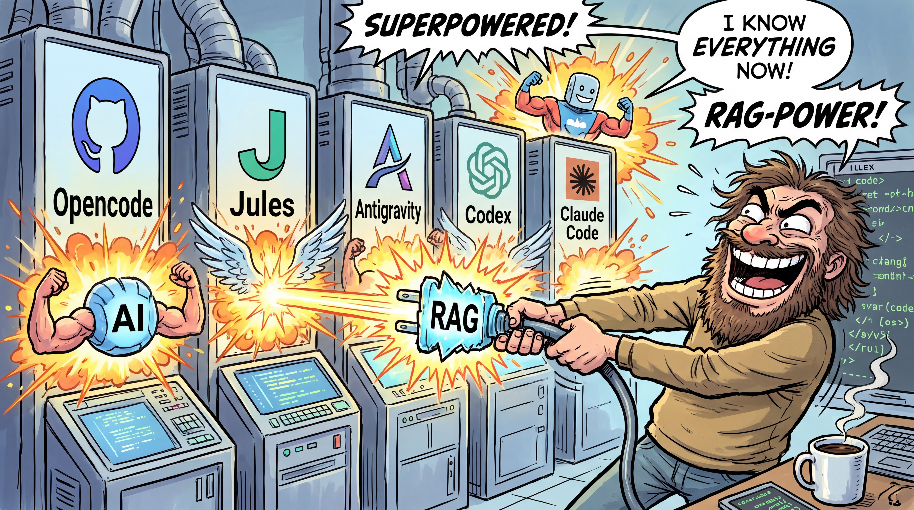

<div align="center">



<br>


<br>

[](https://www.npmjs.com/package/@lotargo/memory_plugin)
[](https://www.npmjs.com/package/@lotargo/memory_plugin)
[](./LICENSE)
[](https://nodejs.org)
[](https://modelcontextprotocol.io)
[](#storage--privacy)

<br>

**Zero-Docker Local Hybrid RAG Engine & Long-Term Memory for AI Coding Agents**

Automatically remembers durable user facts, ingests complex document repositories, and performs high-precision hybrid retrieval across sessions, platforms, and devices.

</div>

---

## Overview

Standard AI coding assistants lose context as soon as a chat session closes or a conversation is reset. You end up repeatedly re-explaining your preferences, architectural decisions, coding style, or project conventions.

`@lotargo/memory_plugin` gives your AI tools durable, **persistent**, local-first long-term memory and document retrieval capabilities that persist across restarts and work seamlessly across all supported coding environments. Any LLM-based coding agent (OpenCode, Claude Code, Codex, Antigravity / Gemini CLI) can query its own memory and hybrid knowledge base via the **Model Context Protocol (MCP)**.

> **Project Scope & Runtime Notes**:
> `@lotargo/memory_plugin` is designed primarily as a practical plugin to expand capabilities and streamline daily interaction with AI coding tools. Benchmark scores in this repository represent internal synthetic evaluation runs and are not intended as generalized RAG benchmarks.
>
> **Hardware Acceleration**: GPU execution mode is an experimental feature and may vary in stability across different operating systems or models. For optimal stability and consistent runtime performance, using standard CPU mode with `multilingual-e5-small` or `multilingual-e5-base` is recommended.

### Practical Use Cases

- **Architectural Decisions**: _"In this project, we use Fastify instead of Express and strict schema validation via Zod."_
- **Coding Conventions**: _"Place all helper utilities inside `src/utils/` and cover new functions with Vitest tests."_
- **Environment Constraints**: _"Our target deployment environment is Node.js 20 on AWS Lambda."_
- **User Profile & Tone**: _"My name is Alex. I prefer concise, direct answers without conversational filler."_

---

## Quick Start

### Minimum System Requirements

- **Node.js**: `22.5.0` or higher (required by the built-in `node:sqlite` module)
- **Package Manager**: `npm` / `npx` (included with Node.js)
- **Supported Environment**: OpenCode, Antigravity / Gemini CLI, Claude Code, Codex, or Google Jules

### Installation & Auto-Setup

Run the setup command to configure all detected AI environments automatically:

```bash
# Recommended: Global installation & auto-setup across all environments
npm install -g @lotargo/memory_plugin && memory_plugin setup

# Or via npx
npx @lotargo/memory_plugin setup
```

To target a specific environment:

```bash
# Antigravity / Gemini CLI
memory_plugin setup --antigravity

# OpenCode
memory_plugin setup --opencode

# Claude Code
memory_plugin setup --claude

# Codex
memory_plugin setup --codex
```

`setup` also accepts `--gemini` (alias for Antigravity) and `--local` (registers the MCP server in the project-local `.agents/` directory). Without a specific flag, all detected environments are configured.

### Headless & Cloud Setup (CI / Docker / Cloud Workspaces)

For headless environments (e.g., Google Jules, VPS, CI/CD pipelines), configure auth and sync mode in a single non-interactive command:

```bash
# Authenticate via Turso API token and set hybrid sync mode
memory_plugin setup --api-key <TURSO_API_TOKEN> --mode hybrid-sync

# Or set sync mode if already authorized
memory_plugin setup --mode only-cloud
```

---

## Multi-Layer Architecture

1. **Layer 1: Notebook Store (Durable Facts)**
   - **Tools**: `remember`, `recall`, `get_fact`, `update_fact`, `forget`, `memory_info`
   - **Scope**: User preferences, identity, project conventions, system rules.
   - **Storage**: Human-readable Markdown format (`global` and per-project stores).
   - **Fact Schema**: Every fact is formatted as `**Title** — body` with inline metadata badges (`[id]`, `[ttl]`, `[keep]`, `[tags]`, `[supersedes]`, `[inject]`).
   - **Project Identity**: Project stores are bound to a **Git-based project identity** — the normalized remote URL (`git:github.com/owner/repo`) or `git:local:<repo basename>` — never to a directory path. Memories follow the repository across machines, OSes, and subdirectories. Legacy path/basename stores can be linked and merged via `link_project_memory`.

2. **Layer 2: RAG Knowledge Base (Technical Documents & Codebases)**
   - **Tools**: `ingest_document`, `query_knowledge_base`, `manage_knowledge_base`, `reindex_knowledge_base`
   - **Capabilities**: Ingests raw text files, Markdown, HTML, Web URLs, office documents (PDF, DOCX, XLSX, CSV), and codebases.
   - **Engine Components**: 3-tier hierarchy chunking (Big / Medium / Small), SQLite FTS5 BM25 search, ONNX dense vector embeddings (`multilingual-e5-small`), Reciprocal Rank Fusion (RRF / RSF), cross-encoder reranking (optional), and GraphRAG Lite code symbol extraction.

3. **Layer 3: Agent-Driven Knowledge Graph**
   - **Tools**: `link_knowledge` (plus `docId`, `startLine`, `endLine` in `remember`)
   - **Capabilities**: Connects Layer 1 notebook facts directly to Layer 2 documents, sections, or exact line ranges with semantic edge relations (`RULES_FOR`, `IMPLEMENTS`, `EXPLAINS`, `REFERENCES`).
   - **Surfacing**: Linked facts automatically highlight target documents and line ranges in `recall` output (`🔗 [Linked Docs: ...]`).

---

## Cloud Synchronization & Database Modes (Turso / LibSQL)

The plugin provides local-first SQLite persistence with optional cloud database synchronization powered by Turso (LibSQL):

### 3 Storage Sync Modes

| Mode | Command / Flag | Description |
| :--- | :------------- | :---------- |
| **`only-local`** (default) | `--mode only-local` | 100% local SQLite database. No external network traffic for data storage. |
| **`only-cloud`** | `--mode only-cloud` | Direct LibSQL connection to a remote Turso database instance. |
| **`hybrid-sync`** | `--mode hybrid-sync` | Local SQLite performance with background asynchronous synchronization to Turso Cloud, featuring automatic reverse-sync and conflict resolution. |

### Cloud Failover & Circuit Breaker

When operating in cloud modes (`only-cloud` or `hybrid-sync`), the database engine incorporates a built-in **Circuit Breaker**:
- If the primary cloud database endpoint is unreachable or encounters network failure, queries fail over to the secondary cloud endpoint configured in `failoverUrl`. Failover is disabled when `failoverUrl` is empty (the default).
- In `hybrid-sync` the local SQLite copy keeps serving reads regardless; in `only-cloud` no local database is opened, so an outage with no `failoverUrl` surfaces as an error.
- Prevents agent blocking or crash loops during internet outages or cloud service degradation.

### Secure Credential Storage

Cloud authentication tokens are never written to `config.json`. They are stored in `auth_secrets.enc`, encrypted with **AES-256-GCM** using a key derived via **PBKDF2-HMAC-SHA256 (600,000 iterations)** from a stable machine fingerprint (OS machine ID + platform + architecture). The file is written with owner-only permissions (`0600`).

> **Note:** this is not an OS keychain (DPAPI / Keychain / Secret Service). The fingerprint components are readable by other processes running as the same user, so the encryption protects against file exfiltration and casual inspection, not against a compromised local account. Secrets are bound to the machine — copying `auth_secrets.enc` to another computer will not decrypt.
>
> **Exception:** the headless fallback via `MEMORY_DIR/.env` (`TURSO_DB_URL`, `TURSO_DB_TOKEN`, `TURSO_API_TOKEN`) stores credentials in **plain text** by design, for Docker/CI deployments.

---

## Available MCP Tools

The MCP server registers **14 MCP tools** accessible across all connected AI environments, plus **2 OpenCode-plugin helper tools** available only inside OpenCode:

### 1. Memory Notebook Tools (Layer 1)

| Tool | Scope / Target | Key Parameters | Description |
| :--- | :------------- | :------------- | :---------- |
| `remember` | `project` / `global` | `fact`, `title`, `scope`, `docId`, `startLine`, `endLine`, `relationType`, `ttl`, `keep`, `tags`, `supersedes` | Save a durable fact or preference. Supports optional title, document linking, TTL, keep protection, tags, and version superseding. |
| `recall` | `all`, `project`, `global`, `list_projects` | `scope`, `project`, `query`, `tags`, `since`, `until`, `mode`, `offset`, `limit` | Display saved facts with metadata badges and linked docs. Supports cross-project lookup via `project: '<path>'` and header-only mode (`mode: "headers"`). |
| `get_fact` | `all`, `project`, `global` | `id`, `scope` | Retrieve full text, raw line, and metadata of a single fact by its metadata ID (e.g. `"8f3a2c"`). |
| `update_fact` | `project` / `global` | `id`, `newText`, `title`, `scope` | Rewrite a fact (and optionally its `**Title**`) while preserving its original creation date, metadata, and knowledge links. |
| `forget` | `project` / `global` | `id` / `range` / `query`, `scope`, `force` | Remove a fact by index number, ID, range (e.g. `"3-30"`), or query. Requires `force: true` for protected (`[KEEP]`) facts. |
| `memory_info` | - | - | Show storage paths, fact counts, RAG statistics, git identity bindings, and package version. |

### 2. Project Identity Tools

| Tool | Key Parameters | Description |
| :--- | :------------- | :---------- |
| `link_project_memory` | `directory`, `remote` | Link a directory path to a Git-based project identity key, register aliases, and migrate legacy path/basename stores with deduplication. |
| `unlink_project_memory` | `directory`, `purge` | Remove a path alias binding for a directory. Optionally purge the project identity entry if `purge: true`. |
| `relink_project_memory` | `directory`, `remote` | Switch a project's primary identity to a new remote URL and merge all stored facts into the target store with fact-text deduplication. |

### 3. RAG Knowledge Base & Graph Tools (Layers 2 & 3)

| Tool | Key Parameters | Description |
| :--- | :------------- | :---------- |
| `ingest_document` | `content`, `type`, `title`, `path`, `generateEmbeddings` | Ingest local files, URLs, or raw text into the 3-tier index (Big/Medium/Small) with ONNX vector embeddings and GraphRAG symbol extraction. |
| `query_knowledge_base` | `query`, `limit`, `instruction`, `generateEmbeddings` | Perform hybrid search (RSF/RRF BM25 + dense vector similarity) to retrieve candidate document sections with defined code symbols. |
| `manage_knowledge_base` | `action`, `docId`, `snapshotPath` | Inspect DB stats (`stats`), list documents (`list`), read full raw document (`read_document`), delete document (`delete`), or export/import snapshots (`export_snapshot` / `import_snapshot`). |
| `reindex_knowledge_base` | `model`, `dimension` | Re-embed all stored vectors with the active (or specified) embedding model and vector dimension. Use after switching the embedding model or vector dimension so previously indexed documents remain retrievable. Preserves documents, FTS index, graph edges, and fact links. |
| `link_knowledge` | `action`, `factText`, `docId`, `scope`, `startLine`, `endLine`, `relationType` | Create, list, or retrieve semantic graph links connecting Notebook facts to Knowledge Base documents, sections, or line ranges. Actions: `link`, `list_links`, `get_doc_links`. |

### 4. Agent & OpenCode Helpers (OpenCode plugin only, not exposed by the MCP server)

| Tool | Key Parameters | Description |
| :--- | :------------- | :---------- |
| `list-mcp-tools` | - | Discover all connected MCP servers and their available tool definitions. |
| `mcp-reminder` | `task` | Recommends the appropriate MCP tool or server for a specific developer task. |

---

## CLI Command Reference

The plugin provides both direct non-interactive CLI commands and an interactive terminal UI (TUI):

```bash
# Executable commands (available globally or via npx)
memory_plugin <command> [options]
# or
memory-cli <command> [options]
```

Both binaries accept the same commands. `memory_plugin` with **no** command starts the MCP server on stdio; `memory-cli` with no command opens the interactive TUI. Use `--help` on either for the full usage text.

> **Secrets:** prefer the environment variables `TURSO_API_TOKEN`, `TURSO_DB_URL` and `TURSO_DB_TOKEN` over `--api-key` / `--db-token` flags — arguments passed on the command line are visible in the process list and shell history. Without a flag or env var, `login` prompts for the token on stdin with echo disabled.

### Direct Non-Interactive Commands

| Command | Options / Flags | Description |
| :------ | :-------------- | :---------- |
| **`setup`** | `--antigravity`, `--opencode`, `--claude`, `--codex`, `--local`, `--api-key <TOKEN>`, `--mode <MODE>` | Configures MCP server registrations across detected environments and sets initial cloud auth/sync mode. |
| **`link`** | `--dir <path>`, `--remote <url>` | Links a directory to a Git project identity or remote URL. |
| **`unlink`** | `--dir <path>`, `--purge` | Unlinks a directory path alias. `--purge` removes the identity record. |
| **`relink`** | `--remote <url>`, `--dir <path>` | Relinks project identity to a new remote URL and merges facts. |
| **`identity`** | `--dir <path>` | Inspects Git project identity key, primary remote, name, and toplevel path for a directory. |
| **`migrate_titles`** | `--key <key>` | Auto-generates `**Title**` prefixes for legacy facts without titles. |
| **`enable-prompt`** | - | Injects memory agent instructions into client agent files (`AGENTS.md`, `CLAUDE.md`). |
| **`disable-prompt`** | - | Removes memory agent instructions from client agent files. |
| **`login`** | `--api-token`, `--from-env`, `--db-url <URL> --db-token`, `$TURSO_API_TOKEN`, `$TURSO_DB_TOKEN` | Authenticates with Turso Cloud via API token, direct DB token, or environment variables. Token values are read from the environment or a hidden stdin prompt. |
| **`logout`** | `--api-key` | Signs out of Turso Cloud or removes stored API key while retaining DB session. |
| **`auth-status`** | - | Displays authentication source, endpoint URL, username, organization, database, and sync mode. |

### Interactive TUI (CLI Menu)

Launch the interactive terminal UI to manage engine settings, tune retrieval algorithms, inspect databases, and run diagnostics:

```bash
memory_plugin cli
# or
memory-cli
```

#### TUI Menu Navigation

Use **Up / Down** arrows to navigate, **ENTER** to select, and **BACKSPACE** to go back.

- **Engine & Hybrid Search Settings**: Switch fusion algorithms (`rsf`, `rrf`, `semantic_only`, `lexical_only`), adjust RSF $\alpha$ balance, select ONNX embedding models, set a fixed embedding vector dimension, toggle Cross-Encoder rerankers, configure GPU attention budget, and set WASM threads.
- **Knowledge Base & Storage Management**: Browse Layer 1 facts, manage Layer 2 RAG docs, re-embed all vectors after switching model/dimension (`[REINDEX]`), export/import JSON snapshots, purge model cache, or perform a hard reset.
- **Global Prompt & Integration**: Toggle memory instruction sync across client configurations (`~/.gemini/config/AGENTS.md`, `~/.codex/AGENTS.md`, `~/.claude/CLAUDE.md`).
- **Diagnostics & System Actions**: Execute a hybrid search verification query, run the graph & notebook linking check, and reset config to factory defaults.

---

## Agent Skill & System Prompt Integration

### Built-in Agent Skill (`using-memory`)

The plugin bundles a pre-configured Agent Skill located at [`skills/using-memory/SKILL.md`](./skills/using-memory/SKILL.md). When installed in supported environments (such as Antigravity / Gemini CLI or OpenCode), coding agents automatically read this skill to:
1. **Initialize Sessions**: Automatically invoke `recall(scope: "all")` at the start of every chat turn to load all saved preferences and project rules.
2. **Proactively Save Context**: Automatically call `remember` whenever you share durable facts, tech stack choices, or coding guidelines.
3. **Architect Knowledge Graphs**: Use `link_knowledge` or `remember(docId, startLine, endLine)` to connect memories directly to technical documentation.

### Global System Prompt Synchronization

Run `memory_plugin enable-prompt` to automatically inject memory agent guidance into your global LLM configuration files:
- `~/.gemini/config/AGENTS.md` (Antigravity / Gemini CLI)
- `~/.codex/AGENTS.md` (Codex)
- `~/.claude/CLAUDE.md` (Claude Code)

This ensures your coding assistant is always aware of its memory capabilities even in fresh workspace sessions.

---

## GraphRAG Lite

The RAG engine includes a lightweight graph layer built on SQLite. It combines code symbol extraction, hierarchy edges, and explicit memory-to-document links without requiring external graph databases or LLM calls at ingest time.

### Multilingual Code Symbol Parsing

During `ingest_document`, code symbols are extracted from code blocks using fast regex heuristics across the following language families:

- **JavaScript / TypeScript**: `function`, `class`, `interface`, `type`, `enum`, `const`, `let`, `var`
- **Python**: `def`, `class`
- **Go**: `struct`, `interface`, `func` (including methods with receivers)
- **Rust**: `struct`, `enum`, `trait`, `fn` (including async/pub)
- **C++**: `class`, `struct`, `namespace`, functions and methods
- **Java & Kotlin**: `class`, `interface`, `record`, `enum`, `fun`, synchronized methods
- **C#**: `class`, `interface`, `struct`, `record`, methods (properties without a parameter list are not captured)
- **PHP**: `class`, `interface`, `trait`, functions
- **Ruby**: `module`, `class`, methods

### Graph Edges

| Relation Type | Direction / Example |
| :--- | :--- |
| `CONTAINS` | Document -> Section -> Micro-Chunk (3-tier hierarchy) |
| `DEFINES_SYMBOL` | Section -> `symbol:<name>` (extracted code symbol) |
| `LINKS_TO` (default) | Memory fact -> Document or line range (via `link_knowledge`) |

---

## Supported Platforms

| Platform | Status | Configuration Mechanism |
| :--- | :--- | :--- |
| **Antigravity / Gemini CLI** | Supported | MCP Server (`~/.gemini/config/mcp_config.json` & `.agents/mcp_config.json`) |
| **OpenCode** | Native | Native plugin + MCP Server (`~/.config/opencode/opencode.json`) |
| **Claude Code** | Supported | MCP Server (`~/.claude.json`) |
| **Codex** | Supported | MCP Server (`~/.codex/config.toml`) |
| **Google Jules** | Supported | MCP Server via global install + setup (`memory_plugin setup`) |

---

## Configuration

The engine is configured through `<memory-dir>/config.json` (created with defaults on first run):

| Key | Default | Description |
| :--- | :--- | :--- |
| `mode` | `only-local` | Storage sync mode: `only-local`, `only-cloud`, or `hybrid-sync` |
| `fusionAlgorithm` | `rsf` | `rsf`, `rrf`, `semantic_only`, or `lexical_only` |
| `alpha` | `0.5` | Vector vs BM25 weight in RSF `[0.0 - 1.0]` |
| `embeddingModel` | `Xenova/multilingual-e5-small` | ONNX dense embedding model (E5 / BGE families supported) |
| `vectorDimension` | `0` | Fixed embedding vector dimension; `0` = auto-detect from the model |
| `rerankerModel` | `none` | Cross-encoder reranker model (e.g. `Xenova/bge-reranker-base`) |
| `rerankerEnabled` | `false` | Enable cross-encoder re-ranking |
| `batchSize` | `12` | Ingestion vector batch size `[1 - 256]` |
| `gpuAttentionBudget` | `2000000` | GPU micro-batch attention budget `[1M - 16M]` |
| `onnxThreads` | `0` | ONNX WASM threads: `0` auto-detect, or `1-16` |
| `executionDevice` | `cpu` | `cpu` or `webgpu` (experimental) |
| `vectorScanLimit` | `50000` | Max micro-chunks scanned per vector query (`0` = unlimited) |
| `injectLimit` | `10` | Max facts injected into the agent's system prompt |
| `conflictStrategy` | `merge` | Hybrid-sync conflict resolution: `merge`, `cloud-wins`, or `local-wins` |
| `tursoUrl` | `""` | Primary Turso endpoint URL (set by `login`) |
| `failoverUrl` | `""` | Secondary cloud endpoint for the circuit breaker; empty = failover disabled |
| `authorized` | `false` | Set to `true` once a cloud login completed |
| `username` | `""` | Account username from the Turso profile |
| `ingestAllowedPaths` | `[]` | Extra directories `ingest_document(type: "file")` may read from |
| `ingestAllowAnyPath` | `false` | Escape hatch: allow reading **any** path from disk (unsafe) |

> `ingest_document(type: "file")` reads only from the current working directory and the plugin data directory by default. This prevents a prompt-injected agent from pulling `~/.ssh/id_rsa` or `.env` into the knowledge base (and, in `hybrid-sync`, into the cloud). Widen it deliberately via `ingestAllowedPaths`.

---

## Testing & Benchmarking

To run the automated test suite and benchmarks locally:

```bash
cd mcp-server

# Run unit and integration tests
npm test

# Run search quality & ingestion benchmarks
npm run benchmark
```

For complete methodology details and search quality evaluation metrics, see [`docs/BENCHMARKS.md`](./docs/BENCHMARKS.md).

### Empirical Search Quality Results

Evaluated across a 32-document technical corpus (21 queries) using Mean Reciprocal Rank (MRR@5), Recall@5, and Normalized Discounted Cumulative Gain (NDCG@5):

| Retrieval Strategy            |   MRR@5    |  Recall@5   |   NDCG@5   |
| :---------------------------- | :--------: | :---------: | :--------: |
| BM25 Lexical Search Only      |   0.6706   |   76.19%    |   0.6934   |
| Dense ONNX Vector Only        |   0.8135   |   100.00%   |   0.8612   |
| Hybrid RRF ($k=60$)           |   0.8810   |   95.24%    |   0.8997   |
| **Hybrid RSF ($\alpha=0.5$)** | **0.9286** | **100.00%** | **0.9473** |

---

## Storage & Privacy

- **Local-First Storage**: All SQLite indexes, ONNX models, CAS blobs, and Markdown notebooks are stored locally in the memory directory. Resolution order: `$MEMORY_DIR` → `$OPENCODE_CONFIG_DIR/memory` → the legacy `~/.config/opencode/memory` directory when it already exists (this takes precedence on Windows too) → `%LOCALAPPDATA%\opencode\memory`.
- **Model Weights**: ONNX weights are downloaded on first use from `https://huggingface.co` and cached locally; later runs are fully offline.
- **Zero Telemetry**: No third-party analytics or telemetry calls are made. The only outbound traffic is the one-off model download, plus Turso requests in the cloud sync modes.

### Known Dependency Advisories

`npm audit` reports three high-severity advisories with no upstream fix available. Both affected packages are only reachable through explicit user action:

| Package | Advisory | Reachability | Mitigation |
| :--- | :--- | :--- | :--- |
| `xlsx` (SheetJS) | Prototype Pollution ([GHSA-4r6h-8v6p-xvw6](https://github.com/advisories/GHSA-4r6h-8v6p-xvw6)), ReDoS ([GHSA-5pgg-2g8v-p4x9](https://github.com/advisories/GHSA-5pgg-2g8v-p4x9)) | Only when you ingest a `.xlsx` / `.xls` / `.csv` file | Do not ingest untrusted spreadsheets. A migration to `exceljs` is under consideration. |
| `sharp` `<0.35.0` (via `@huggingface/transformers`) | libvips CVE-2026-33327 / 33328 / 35590 / 35591 ([GHSA-f88m-g3jw-g9cj](https://github.com/advisories/GHSA-f88m-g3jw-g9cj)) | Image decoding path only; this plugin runs text embedding models exclusively and never feeds images to `sharp` | Not reachable in normal use; will clear once `@huggingface/transformers` bumps `sharp`. |

---

## License

[MIT](./LICENSE)
